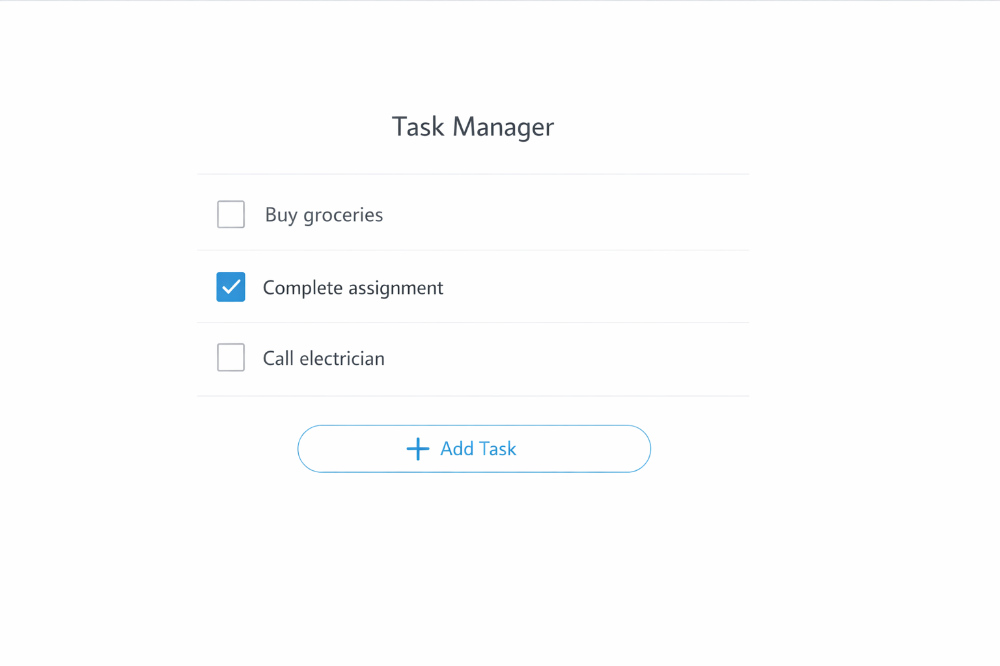
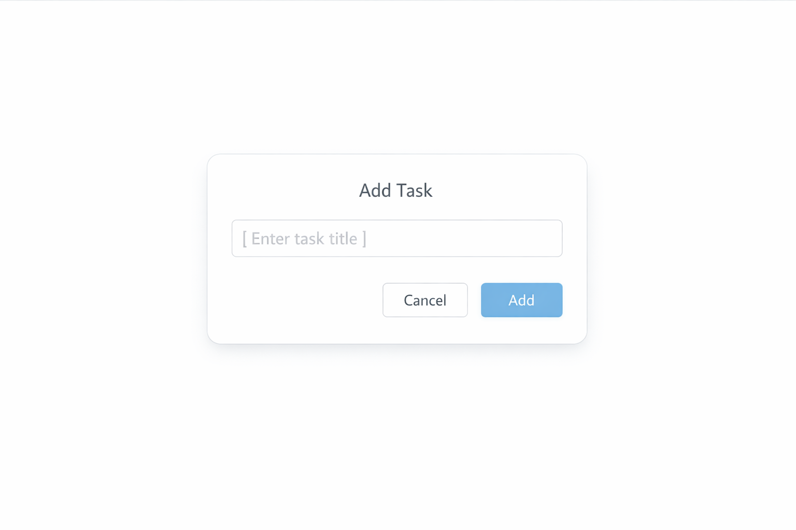
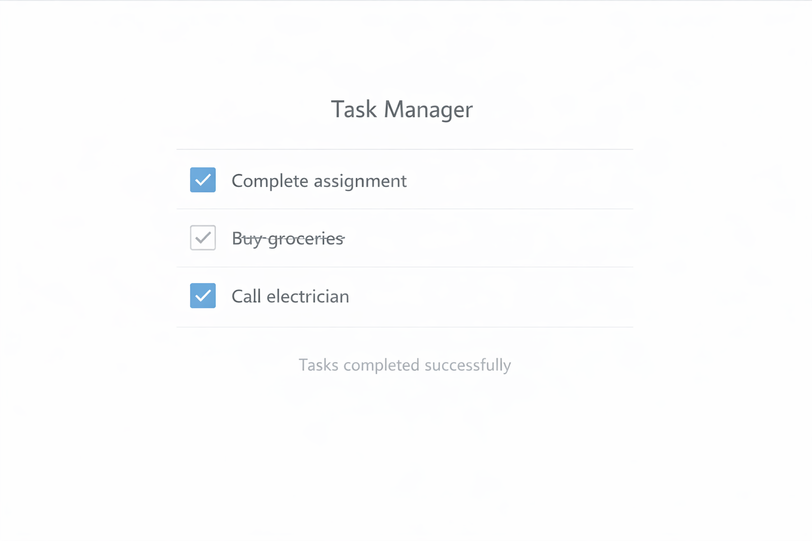

# Flutter Task Manager App

A simple Flutter-based task management application designed to demonstrate state management, user input handling, and dynamic UI rendering.

## Features
- Add new tasks using dialog-based input
- Mark tasks as completed
- Delete existing tasks
- Clean and minimal Material UI design

## Tech Stack
- Flutter
- Dart
- Material Design

## Screenshots

| Home Screen | Add Task | Completed Task |
|------------|----------|----------------|
|  |  |  |

## Project Structure
- `lib/main.dart` – Core application logic and UI
- `pubspec.yaml` – Dependency and configuration file

## How to Run
1. Install Flutter SDK
2. Clone this repository
3. Run `flutter pub get`
4. Run `flutter run`
